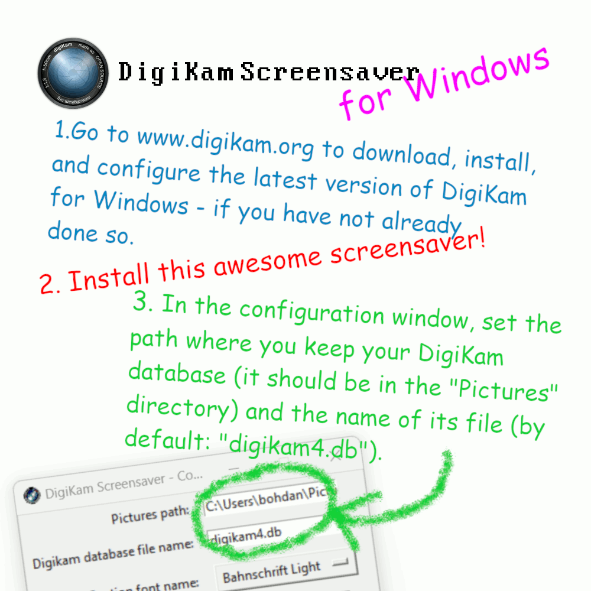
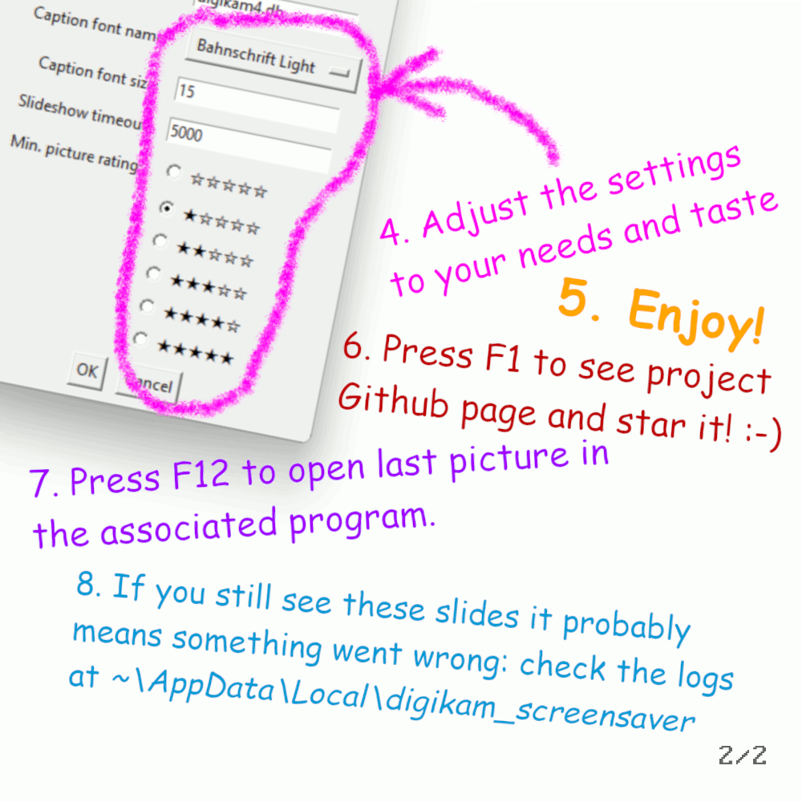

# DigiKam Screensaver

    

Windows screensaver, from pictures loaded out from DigiKam database in Python.

As for now - this is just for Windows.

## Instructions

## Features

- Takes random photos from digikam4.db SQLite database - but only `*.jpg` and rated (with at least one star).
- Some configuration is needed.
- Database is opened in read-only mode!
- Pressing `<F-12>` will (obviously) turn off screen saver, but I've added a function that will open current picture in associated app.
- Pressing `<F-1>` will open project Github page.  

## Known issues

- screensaver work just **for one monitor**
- **preview does not work**: _none of python screensaver examples has this feature_, and to make it working I need to
display screensaver in given window handler number (Windows passes it via cmdline, I'm parsing that but Tkinter AFAIK
can't display or create window inside other window): see how it's done
[here, in C](https://github.com/henrypp/matrix/blob/master/src/main.c).
- because of these two problems above, I'm considering change Tkinter to other library 
([Arcade](https://api.arcade.academy/en/latest/index.html)? [Pygame](https://www.pygame.org/news)?) and keep Tkinter
just for configuration window 
- the choice of Python for this kind of program (it's more for a demonstration - hold my beer, I'll show you something
cool) is not very optimal, mainly because of the size and the way the binary generated by PyInstaller works,
it's also like a **red rag to a bull for antiviruses**... but anyone who knows anything about PyInstaller will understand

## Dev environment

This will work on Windows cmd:

    git clone git@github.com:bohdanbobrowski/digikam_screensaver.git
    cd digikam_screensaver
    python -m venv venv
    venv\Scripts\activate
    pip install -e '.[dev]'

Run configuration windows first:

    python digikam_screensaver/screen_saver.py /c

It should look like this:

Then, to test how does it work just type:

    python digikam_screensaver/screen_saver.py /s

Preview mode can be reached by typing:

    python digikam_screensaver/screen_saver.py /c

### Building own *.scr

If all required stuff is installed in system, this command should make the job:

    python digikam_digikam_screensaver_build.py

You'll find exe in `.\dist` folder - just rename it to scr and install.

## Documentation and inspiration

### Python:

1. https://github.com/SirGnip/arcade_screensaver_framework
2. https://github.com/gaming32/Windows-Screensaver

This might be interesting, according attaching window to given win32 handler:

3. https://github.com/quasar098/dvd-screensaver/blob/master/main.py

### C:

4. https://github.com/henrypp/matrix

### Win32 Screensaver API documentation:

5. https://learn.microsoft.com/en-us/windows/win32/lwef/screen-saver-library
6. https://learn.microsoft.com/en-us/previous-versions/troubleshoot/windows/win32/screen-saver-command-line

### Other:

8. Interesting discussion about screensaver settings window (which didn't changed since 20 years):
https://www.reddit.com/r/Windows11/comments/q0b427/the_screensaver_settings_have_looked_like_this/
